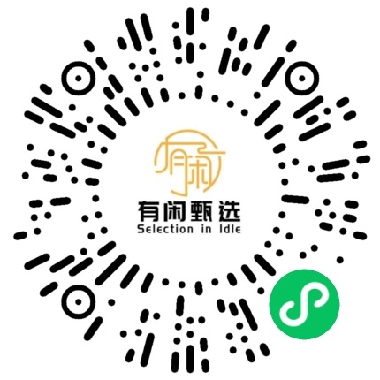

# 有闲甄选 | 品质二手笔记本，企享收直供

> 国家级高新技术企业 · 5000万+设备处置经验 · 0数据泄露

---

## 买二手笔记本，你最怕什么？

| 😰 货不对板 | 🔋 电池老化 | 🛠️ 暗病隐患 | 🚫 售后无保障 |
|:-----------|:-----------|:------------|:-------------|
| 图片精美，到手满是划痕磕碰 | 健康度不透明，用半天就得插电 | 到手即坏，维修无门 | 出了问题找不到人 |

这些坑，我们都替你踩过 —— 所以有了有闲甄选。

---

## 我们不一样

### 1. 12道严苛检测，每台都实测
屏幕坏点、触控灵敏度、**电池健康度**、摄像头成像、全端口功能、WiFi蓝牙、CPU/GPU压力测试、硬盘健康状态……专业团队逐项过检，出具完整检测报告，好坏一目了然。

### 2. 成色分级透明，所见即所得
A+ 级（几乎全新，轻微使用痕迹）到 B 级（正常使用痕迹），每档标准清晰，实物实拍，绝不拿翻新机充好货。

### 3. 365天超长质保
市面大多30天或90天，我们给足一整年。质保期内非人为故障免费维修，让你用得踏实。

### 4. 7天无理由退换
收货不满意？随时退。全程小程序跟踪退款进度，不用打电话不用扯皮。

---

## 关于企享收

**上海珑荟环保科技有限公司**（品牌「企享收 QXS」）是一家专注于企业 IT 设备资产管理及数据安全领域的**国家级高新技术企业**，总部位于上海，服务辐射全国。

过去，我们主要为政府、高端制造、金融、互联网、医疗等行业的世界 500 强企业提供设备回收与数据安全销毁服务 —— 累计处置设备超 **5,000 万台**，**0 数据泄露**事件，持有 ISO 27001、ISO 14001、R2v3 等国际认证。

这些从企业回收的设备中，大量笔记本、工作站成色优异、性能完好，过去主要通过全国小同行渠道批发流通。现在，我们开通了 **「有闲甄选」小程序**，**跳过中间商，直面个人用户** —— 把企业级回收的好机器，以更实惠的价格直接交到你手里。

| 500+ 企业客户 | 5000万+ 设备处置量 | 0 数据泄露事件 | 100% 合规达标率 |
|:-------------|:------------------|:--------------|:---------------|

---

## 花更少的钱，用一样的品质

一台 ¥12,000 的全新 ThinkPad X1 Carbon，
在我们这里 ¥5,500 就能拿下 A+ 级同款。

电子产品贬值快，买二手不是将就，
而是 **跳过品牌溢价，只为核心体验买单**。

何况，每台都经过 12 道检测，
带 365 天质保 —— 比某些渠道买新的还靠谱。

---

## 严选品牌，丰富品类

**Apple · ThinkPad · 华为 · 联想 · 华硕 · 惠普 · 戴尔 · 微软**

轻薄本 · 游戏本 · 移动工作站 · 二合一平板

从 ¥2,000 出头的入门办公机，
到 ¥15,000+ 的高配工作站，
每一个价位段，都有我们的严选推荐。

---

## 下单四步走，比网购还简单

1. **🔍 挑选好物** — 按品牌/价位筛选
2. **🛒 加入购物车** — 多件合并下单
3. **💳 微信支付** — 安全快捷
4. **📦 顺丰包邮** — 24h内发出

---

## 六大服务承诺

| 🛡️ 365天质保 | ✅ 正品保障 | 🚚 24h极速发货 |
|:-------------|:-----------|:--------------|
| ↩️ 7天无理由退换 | 🧹 深度清洁消毒 | 💬 终身技术咨询 |

---

## 他们都在用

> ⭐⭐⭐⭐⭐
> "ThinkPad X1 Carbon 到手几乎全新，电池健康度 91%，跑分一切正常，比新机便宜了一半多，太值了！"
> — 程序员小陈

> ⭐⭐⭐⭐⭐
> "给上大学的妹妹买的 MacBook Air M1，成色跟新的一样，检测报告每一项都标注清楚了，客服全程指导验机，很放心。"
> — 大学生家属张姐

> ⭐⭐⭐⭐⭐
> "公司采购了 3 台 ThinkPad 给新同事，性能稳、价格香，一年质保也比别的平台有底气。"
> — 创业团队负责人老李

---

## 品质二手，就在这里

**长按识别小程序码，立即选购**

或点击公众号下方店铺入口

---

© 2026 有闲甄选 Selection in Idle · 品质好物 精心甄选
